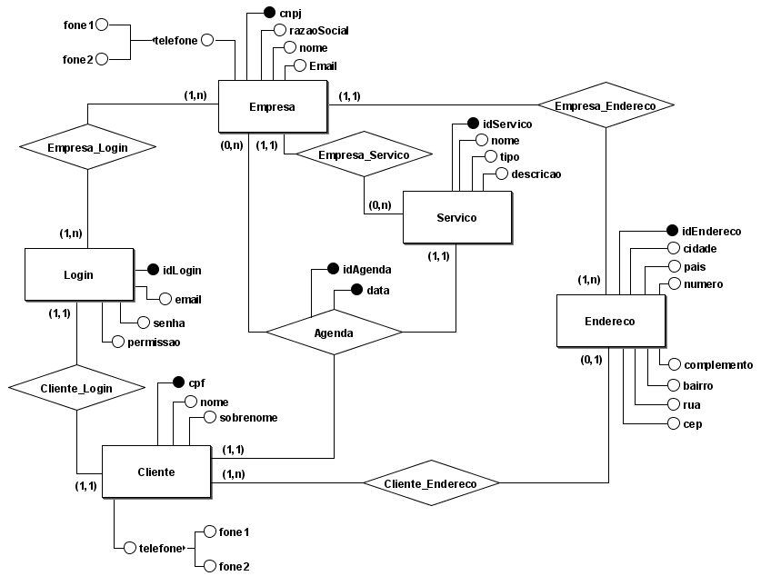
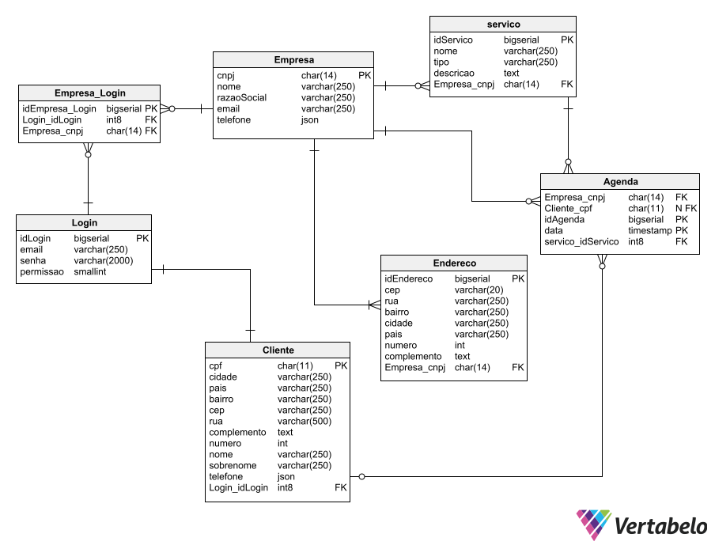

### Banco de Dados II
# Atividade Prática Supervisionada 

Uma aplicação quando se trata de atender um sistema exigem uma base de dados, para o projeto proposto de um sistema de agendamento de atendimento, o sistema em questão opera com algumas funcionalidades.

A aplicação conta com dois tipos de usuarios, a empresa, e o cliente tendo eles um relacionamento atravéz do agendamento do atendimento.

Para uma melhor relação alguns dados são importantes para trazer mais informações ao aplicar o banco de dados a uma aplicação, esses dados são contato dos usuarios, localização da empresa, serviços oferecidos, e acesso do usuario com dados de login.

Visando construir uma aplicação de gerenciamento de atendimentos uma ótima estrutura de dados se faz necessário, ou seja, uma ótima construção da base de dados irá afetar diretamente no desempenho da aplicação, assim, para que o software não sofra com gargalos de buscas iremos utilizar técnicas de modelagem avançada para construção do banco de dados confiável e utilizar de mecanismos avançados sendo eles indexação, funções, views, triggers.

O sistema de agendamento terá as seguintes funcionalidades previstas:

- Cadastro de usuário
- Agenda do prestador de serviço
- Controle do serviço (cadastros dos dias e horários)
- Endereço (Cliente e Prestador)
- Histórico de atendimentos (Cliente e Prestador)

## Diagrama Entidade e Relacionamento

<h1 align="center">
  
</h1>

## Modelo Lógico

<h1 align="center">
  
</h1>

## 📜 Scripts de criação

<a href='https://github.com/ander5onPereira/Banco_de_Dados_II/blob/ae36063e8ffb533a80a1a4dff62b580e0592ed98/SQL/create_table.sql'>create_table</a> : sql para criar tabelas

## 👨‍👩‍👦 População da tabela

<a href='https://github.com/ander5onPereira/Banco_de_Dados_II/blob/ae36063e8ffb533a80a1a4dff62b580e0592ed98/SQL/populate.sql'>populate</a> : sql para popular as tabelas

## Indexação

## Funções

## Views

## Triggers

## Status
 - ~~Escolha uma aplicação que existam dados correlacionados e a descreva.~~
 - ~~Elabore um diagrama Entidade-Relacionamento para esta aplicação.~~
 - ~~Faça o mapeamento para o modelo relacional, indicando as restrições de integridade.~~
 - ~~Gere o Script de criação de tabelas no PostgreSQL com as restrições.~~
 - ~~Popule as tabelas com alguns dados (preferência reais, se possível), suficiente para consultas.~~
 - ~~Crie índices adequados às consultas, indicando as consultas que foram beneficiados, mostrando
também o resultado do explain.~~
- Crie 3 funções que representem consultas corriqueiras, ou realizem alguma tarefa nas tabelas.
- Crie 3 visões comuns e uma tabela de auditoria para um tabela.
- Crie 3 triggers que tratem eventos em tabelas com atributos derivados e auditorias acima.

