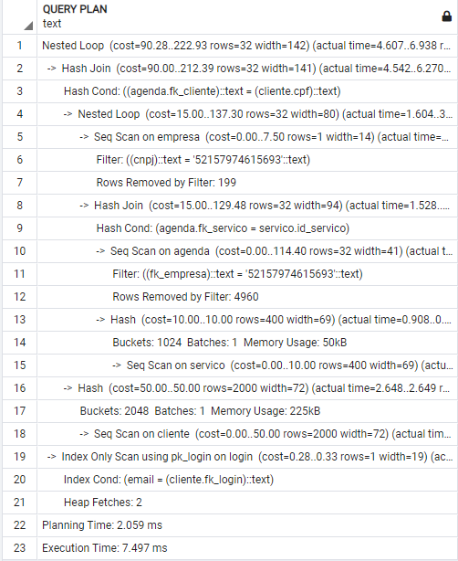
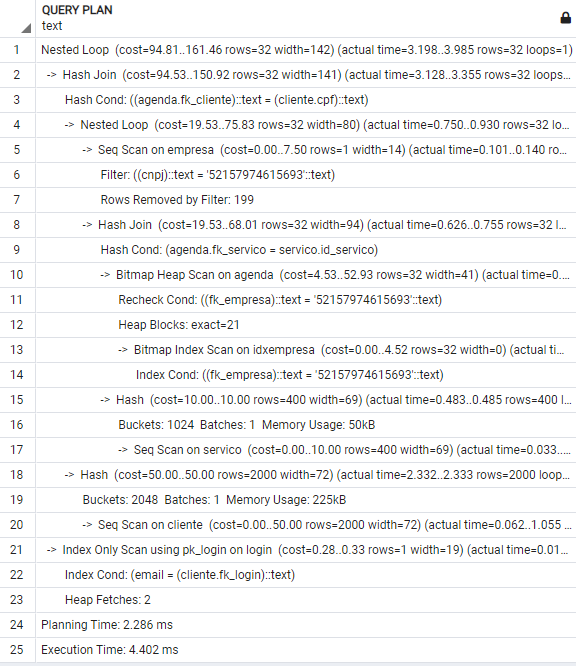
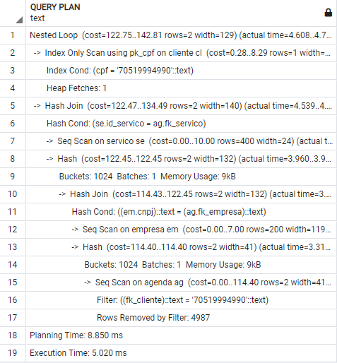
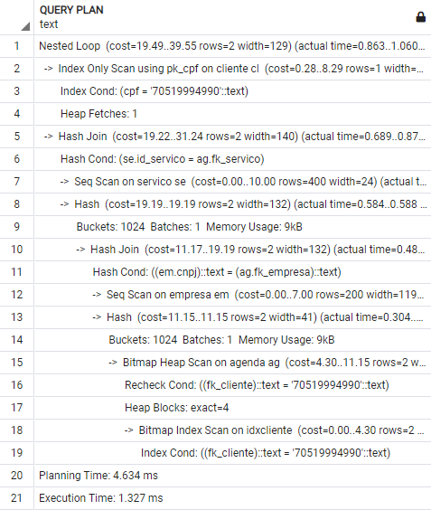
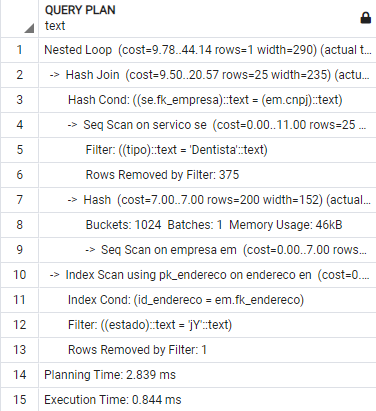
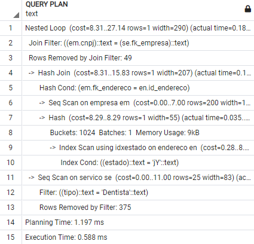

<div align="center">

### Banco de Dados II
# Atividade Prática Supervisionada 

</div>

<div style="margin-top:15px;text-align: justify;border-bottom:1px;
  border-bottom-style: solid;
  border-bottom-color: darkgrey;">
<p>
Uma aplicação quando se trata de atender um sistema é necessária uma base de dados, para o projeto proposto no qual é um sistema de agendamento de atendimento, o sistema em irá operar com as seguintes funcionalidades:

- Usuários: contratam o serviço que as empresas oferecem;
- Empresa: Disponibiliza serviços a serem contratados por usuários.

Para esse modelo de negócio, se faz necessário a presença de uma terceira entidade, que é a de agendamento que irá fazer a relação entre empresa e cliente através do controle dos atendimentos.

Para uma melhor relação alguns dados são importantes para trazer mais informações ao aplicar o banco de dados a uma aplicação, esses dados são contato dos usuários, localização da empresa, serviços oferecidos, e acesso do usuário com dados de login.

Visando construir a aplicação de gerenciamento de atendimentos e buscando eficiência, uma ótima estrutura de dados se faz necessário, ou seja, uma construção da base de dados sólida irá contribuir no desempenho da aplicação. Desta maneira, para que o software não sofra com gargalos de buscas iremos utilizar técnicas de modelagem avançada para construção do banco de dados confiável e utilizar de mecanismos avançados sendo eles: indexação, funções, views e triggers.

O sistema de agendamento terá as seguintes funcionalidades previstas:
</p>

- Cadastro de usuário
- Agenda do prestador de serviço
- Controle do serviço (cadastros dos dias e horários)
- Endereço (Cliente e Prestador)
- Histórico de atendimentos (Cliente e Prestador)

</div>

<div >

## Diagrama Entidade e Relacionamento

<h1 align="center">
  
</h1>

</div>

<div >

## Modelo Lógico

<h1 align="center">
  
</h1>
</div>

<div style="margin-top:15px;text-align: justify;border-bottom:1px;
  border-bottom-style: solid;
  border-bottom-color: darkgrey;">

## 📜 Scripts de criação

<a href='https://github.com/ander5onPereira/Banco_de_Dados_II/blob/ae36063e8ffb533a80a1a4dff62b580e0592ed98/SQL/create_table.sql'>create_table</a> : sql para criar tabelas

``` In Script ```

- CREATE TABLE login
- CREATE TABLE endereco
- CREATE TABLE cliente 
- CREATE TABLE empresa
- CREATE TABLE servico
- CREATE TABLE agenda

</div>

<div style="margin-top:15px;text-align: justify;border-bottom:1px;
  border-bottom-style: solid;
  border-bottom-color: darkgrey;">

## 👨‍👩‍👦 População da tabela

<a href='https://github.com/ander5onPereira/Banco_de_Dados_II/blob/46ed859ecab500edd2fc1ef1e68408fdb2d8ebc8/SQL/populate.sql'>populate</a> : sql para popular as tabelas

``` In function Script ```

- function numero_big
- function numero
- function data
- function texto
- function random_nome
- function email_random
- function pais_random
- function servico_random

``` In Script INSERT ```

- INSERT INTO Login
- INSERT INTO endereco
- INSERT INTO cliente
- INSERT INTO Empresa
- INSERT INTO Servico
- INSERT INTO Agenda

</div>

<div style="margin-top:15px;text-align: justify;border-bottom:1px;
  border-bottom-style: solid;
  border-bottom-color: darkgrey;">

## Indexação

<a href='https://github.com/ander5onPereira/Banco_de_Dados_II/blob/46ed859ecab500edd2fc1ef1e68408fdb2d8ebc8/SQL/indexacao.sql'>indexacao</a> : sql com algumas indexações

``` In Script ```

- index idxEmpresa
- index idxEstado
- index idxCliente
- index idxServico
- index idxNomeCliente
- index idxNomeServico

</div>

<div style="margin-top:15px;text-align: justify;border-bottom:1px;
  border-bottom-style: solid;
  border-bottom-color: darkgrey;">

## Funções

<a href='https://github.com/ander5onPereira/Banco_de_Dados_II/blob/46ed859ecab500edd2fc1ef1e68408fdb2d8ebc8/SQL/functions.sql'>functions</a> : sql com algumas funções

``` In Script ```

- FUNCTION AgendaCliente
- FUNCTION AgendaData
- FUNCTION QuantidadeCliente

</div>

<div style="margin-top:15px;text-align: justify;border-bottom:1px;
  border-bottom-style: solid;
  border-bottom-color: darkgrey;">

## Views

<a href='https://github.com/ander5onPereira/Banco_de_Dados_II/blob/46ed859ecab500edd2fc1ef1e68408fdb2d8ebc8/SQL/view.sql'>view</a> : sql com algumas views

``` In Script ```

- VIEW qtdempresaservico
- VIEW InfoCliente
- VIEW EmpFilias

</div>

<div style="margin-top:15px;text-align: justify;border-bottom:1px;
  border-bottom-style: solid;
  border-bottom-color: darkgrey;">

## Triggers

<a href='https://github.com/ander5onPereira/Banco_de_Dados_II/blob/46ed859ecab500edd2fc1ef1e68408fdb2d8ebc8/SQL/triggers.sql'>triggers</a> : sql com algumas triggers

``` In Script extra tables ```

- CREATE TABLE audit_agenda
- CREATE TABLE audit_login
- CREATE TABLE audit_cliente

``` In Script triggers ```

- TRIGGER agenda_audit
- TRIGGER login_audit
- TRIGGER cliente_audit

</div>


<div style="margin-top:15px;text-align: justify;border-bottom:1px;
  border-bottom-style: solid;
  border-bottom-color: darkgrey;">

## Status
 - ~~Escolha uma aplicação que existam dados correlacionados e a descreva.~~
 - ~~Elabore um diagrama Entidade-Relacionamento para esta aplicação.~~
 - ~~Faça o mapeamento para o modelo relacional, indicando as restrições de integridade.~~
 - ~~Gere o Script de criação de tabelas no PostgreSQL com as restrições.~~
 - ~~Popule as tabelas com alguns dados (preferência reais, se possível), suficiente para consultas.~~
 - ~~Crie índices adequados às consultas, indicando as consultas que foram beneficiados, mostrando também o resultado do explain.~~
- ~~Crie 3 funções que representem consultas corriqueiras, ou realizem alguma tarefa nas tabelas.~~
- ~~Crie 3 visões comuns e uma tabela de auditoria para um tabela.~~
- ~~Crie 3 triggers que tratem eventos em tabelas com atributos derivados e auditorias acima.~~

</div>

<div style="margin-top:15px;text-align: justify;border-bottom:1px;
  border-bottom-style: solid;
  border-bottom-color: darkgrey;">

## Teste desempenho dos indices

``` Indice idxEmpresa ```

<h1 align="middle">
  
  
</h1>

``` Indice idxCliente ```

<h1 align="middle">
  
  
</h1>

``` Indice idxEstado ```

<h1 align="middle">
  
  
</h1>

</div>